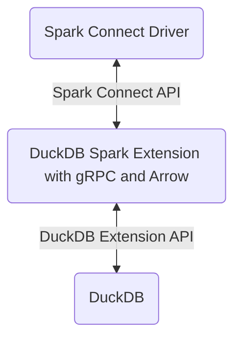
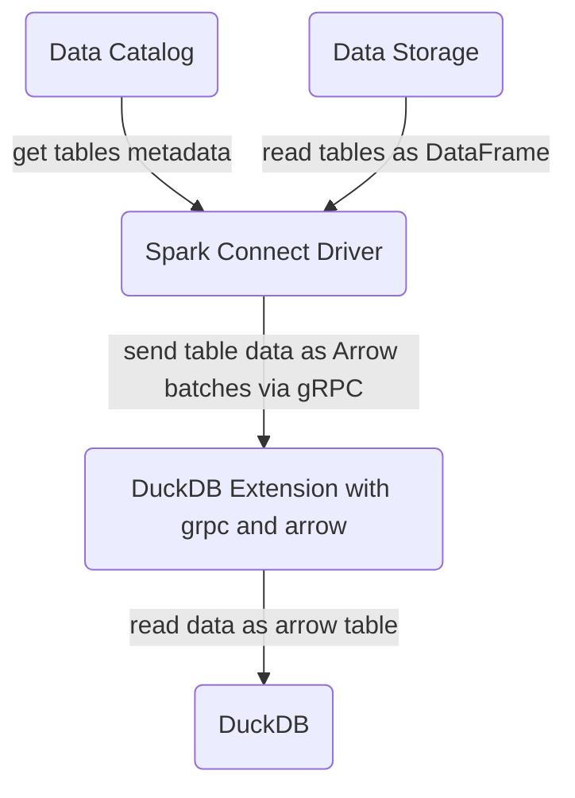
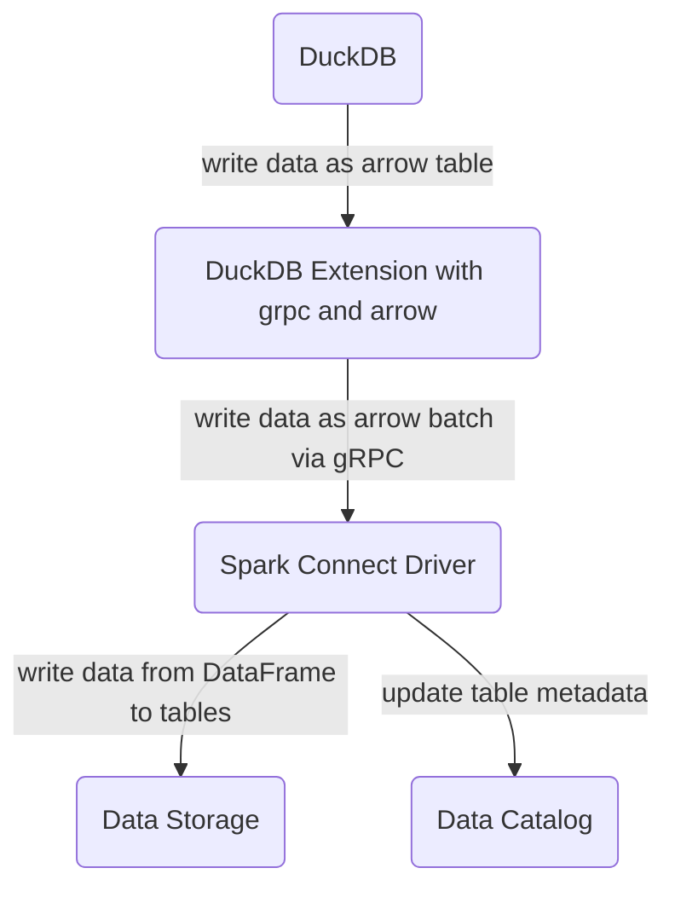

# DuckDB - Spark Connect Extension
## Introduction
A project to build DuckDB extension to connect to Spark via Spark Connect API - so DuckDB can read/write data via Spark.

## Design

### Overview


### Read path



### Write path



## Setup VSCode Development Environment
1. Install VSCode extensions:
- clangd: `llvm-vs-code-extensions.vscode-clangd`
- c/c++ extension pack: `ms-vscode.cpptools-extension-pack`

2. Setup `clangd`:
- after run `make` successfully, run script to tell clangd how your project is built (by create a link to built `compile_commands.json` file).

```bash
ln -s build/release/compile_commands.json compile_commands.json
```

3. Enjoy development.
## Documentation
- [Extension Docs](./docs/README.md)
